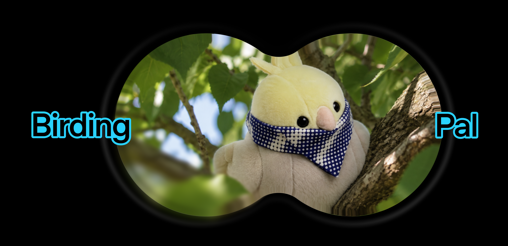

# Birding Pal

Birding Pal is a small field companion for birding. We paired a plush bird with
a custom Bluetooth controller and a ChatGPT-based voice interface so you can
press the bird, talk about what you see or hear, record a bird call, and save
confirmed bird sightings to a personal bird book.

Our goal was to make the interaction feel less like pulling out a phone and more
like carrying a tiny friendly AI-enabled buddy outdoors.

## What We Built

The system has two main pieces:

- **The Hardware:** a plush bird with pressure inputs, Bluetooth, status lights,
  microphone, speaker, and a microcontroller.
- **The Software:** a mobile app that powers the conversation, bird-call
  recording, optional BirdNET-compatible analysis, and bird book.

The software can run by itself, but the hardware gives the project its intended
shape: a tactile companion you can clip to a bag, hold in your hand, and use
without staying focused on a screen.

## Hardware

The prototype hardware includes:

- Adafruit QT Py ESP32-S3, no PSRAM
- DFRobot BT401 Bluetooth module
- Force-sensitive resistor inputs
- Addressable NeoPixel LED
- LiPo battery and charger/breakout
- Microphone, amplifier, and speaker
- Jumper wires and a plush/enclosure

The firmware reads the pressure inputs, drives the status LED, configures the
BT401 module, and hosts a local Wi-Fi dashboard for debugging and threshold
tuning.

## How It Works

Pressing the plush sends Bluetooth events to the companion app. One action
starts or stops a voice session; another records ambient audio for bird-call
analysis. The assistant can identify likely species, explain what it heard, and
add confirmed sightings to the bird book.

The voice experience uses the
[OpenAI Realtime API](https://platform.openai.com/docs/guides/realtime). The
optional BirdNET-compatible endpoint receives recorded WAV audio with location
and week-of-year metadata, then returns species candidates for the assistant to
interpret.

Note: `GPT-Live-1` is not yet available on the OpenAI API platform; this
repository uses `gpt-realtime` for the Realtime API integration.

## License

This project is licensed under the MIT License. See [LICENSE](LICENSE).
