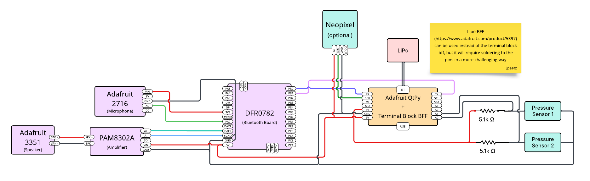

← [Birding Buddy](../README.md)

# Birding Buddy — Firmware

Firmware for the Birding Buddy hardware button. An Adafruit QT Py ESP32-S3 reads the Bird Buddy 2 hardware inputs, drives a status NeoPixel, hosts a local debug dashboard, and configures a DFRobot BT401 Bluetooth module for BLE pass-through and Bluetooth audio. The button pairs with the [Android app](../android/README.md) to trigger voice sessions and bird-call recording hands-free.

Sketch: [`BirdBuddy_Firmware/BirdBuddy_Firmware.ino`](BirdBuddy_Firmware/BirdBuddy_Firmware.ino)

## Features

- **BLE triggers** — two active-low FSR inputs send configurable BLE payloads to the paired Android app to start or stop a session
- **Bluetooth audio** — BT401 exposes a Classic Bluetooth audio interface alongside BLE
- **Status NeoPixel** — color-coded LED reflects idle, charging, and input states at a glance
- **Debug dashboard** — browser-based UI served over Wi-Fi for live status, two-channel threshold tuning, payload editing, and BT401 AT commands

## Requirements

- [Arduino IDE](https://www.arduino.cc/en/software) 2.x or the [Arduino CLI](https://arduino.github.io/arduino-cli/)
- Board package: **esp32** by Espressif (tested with 3.x)
- Target board: **Adafruit QT Py ESP32-S3 (no PSRAM)**
- A DFRobot BT401 Bluetooth module wired per the pinout below

## Setup

### 1. Install the board package

In Arduino IDE: **File → Preferences → Additional boards manager URLs**, add:

```
https://raw.githubusercontent.com/espressif/arduino-esp32/gh-pages/package_esp32_index.json
```

Then install **esp32** from **Tools → Board → Boards Manager**.

### 2. Select the board

**Tools → Board → esp32 → Adafruit QT Py ESP32-S3 (no PSRAM)**

### 3. Configure Wi-Fi

Open `BirdBuddy_Firmware/BirdBuddy_Firmware.ino` and update the credentials near the top of the file:

```cpp
static const char *WIFI_SSID = "your-ssid-here";
static const char *WIFI_PASSWORD = "your-password-here";
static const char *AP_PASSWORD = "your-fallback-ap-password-here";
```

The sketch tries to join this network on boot. If it cannot connect, it automatically falls back to a local access point using `AP_PASSWORD` — see [Dashboard](#dashboard) below.

### 4. Upload

Connect the QT Py over USB, select the correct port under **Tools → Port**, and click **Upload**.

## Hardware

| Part | Qty | Vendor/Part # | Desc | 
| ---- | --- | ------------- | ---- | 
| QT Py ESP32-S3  | 1 | [Adafruit 5426](https://www.adafruit.com/product/5426) | Main Controller | 
| Force Sensitive Resistor | 2 | [Adafruit 166](https://www.adafruit.com/product/166) | Sensors for Wing Press |
| Resistor, 5.1k | 2 |   | Resistor for FSR Voltage Divider |    |
| Lipo | 1 | [Adafruit 4236](https://www.adafruit.com/product/4236) | Battery |
| Charger and Breakout | 1 | [Adafruit 6495](https://www.adafruit.com/product/6495) | Allows for easy connection of all parts |
| Bluetooth Module | 1 | [DFRobot DFR0782](https://www.dfrobot.com/product-2178.html) | Handles Bluetooth Audio and BLE |
| Microphone | 1 | [Adafruit 2716](https://www.adafruit.com/product/2716) | Mic for Audio |
| Amplifier | 1 | [Adafruit 2130](https://www.adafruit.com/product/2130) | PAM8302A 2.5W Amp |
| Speaker | 1 | [Adafruit 3351](https://www.adafruit.com/product/3351) | Speaker for Audio | 
| Neopixel | 1 | [Adafruit 1260](https://www.adafruit.com/product/1260) | Status LED | 

### Connections

- Board: Adafruit QT Py ESP32-S3
- FSR 1: `A3` / GPIO8, use a voltage divider with a 5.1k resistor
- FSR 2: `SCL` / GPIO6, use a voltage divider with a 5.1k resistor
- Status NeoPixel: `SCK` / GPIO36 to DIN on neopixel
- BT401 UART:
  - QT Py `TX` / GPIO5 → BT401 `PB1` / UART RX
  - QT Py `RX` / GPIO16 → BT401 `PB0` / UART TX
  - GND → BT401 GND
  - 5V → BT401 GND
- BT401 Audio Connections:
  - BT401 3V3 → Mic VIN Pin
  - BT401 PA0 → Mic AC Pin
  - BT401 GND and SGND Pins → Mic GND Pin (make the connection between the BT401 GND and SGND close to the BT401 board)
  - BT401 DACL → Amp A+ Pin
  - BT401 SGND → Amp A- Pin
  - BT401 5V → Amp VIN Pin
  - BT401 GND → Amp GND Pin 

### Schematic
  

## Bluetooth

### Names

- BLE interface: `BIRD_BUDDY_BLE`
- Classic audio interface: `BIRD_BUDDY_AUDIO`

### BLE Payloads

Default payloads sent to the Android app:

- FSR 1 (`A3`) payload: `00 45`
- FSR 2 (`SCL`) payload: `00 43`


### BT401 Setup

On boot, the sketch automatically sends a setup sequence to the BT401 that enables Classic/EDR, Bluetooth audio, Bluetooth call support, and BLE, and sets the device names and UUIDs:

| Role | UUID |
|---|---|
| Service | `0000B001` |
| Write | `0000FFF1` |
| Notify | `0000B101` |
| Read | `0000FFF3` |

If the BT401 ever loses its settings, use the **Re-send BT Setup** button on the dashboard or run `/setup-bt` over serial to re-apply them.

## Dashboard

The sketch hosts a browser-based dashboard over Wi-Fi.

- **Primary URL** (if connected to your network): `http://bird-buddy.local`
- **Fallback AP SSID**: `BirdBuddy-Setup` — the sketch creates this hotspot automatically if it cannot join your network
- **Fallback AP password**: whatever you set in `AP_PASSWORD`
- **Fallback AP address**: `http://192.168.4.1`

Dashboard capabilities:

- View current FSR, SCL FSR, charge, Wi-Fi, BT401, and NeoPixel status
- Adjust and persist active-low press/release thresholds for both FSR inputs
- Edit the BLE payload bytes sent by the FSR and SCL FSR triggers
- Test-fire the FSR and SCL FSR BLE payloads
- Send raw BT401 AT commands
- Re-send the BT401 Bluetooth setup sequence
- Inspect raw status JSON

## LED Status

| Color | Meaning |
|---|---|
| Green | Normal idle |
| Blue | FSR 1 (`A3`) is pressed |
| Purple (2 s) | FSR 2 (`SCL`) state change |

## Serial Commands

Open the serial monitor at `115200 baud`.

| Command | Description |
|---|---|
| `/help` | Show available commands |
| `/status` | Print pin/input status and query BT401 |
| `/setup-bt` | Re-send BT401 setup commands |
| `/thresholds` | Print active-low thresholds for both FSR inputs |
| `/inputs on` | Print raw FSR values every 200 ms when compiled with `DEBUG_INPUTS` |
| `/inputs off` | Stop periodic raw FSR prints when compiled with `DEBUG_INPUTS` |
| `/send-fsr` | Send the FSR BLE payload |
| `/send-sw` | Send the second-FSR/"switch" BLE payload |

## Troubleshooting

- **Dashboard unreachable** — if `bird-buddy.local` doesn't resolve, check the serial monitor for the printed IP address. If Wi-Fi failed entirely, connect your phone or laptop to the `BirdBuddy-Setup` hotspot and open `http://192.168.4.1`.
- **Wrong Wi-Fi credentials** — update `WIFI_SSID` and `WIFI_PASSWORD` in the sketch (Setup step 3) and re-upload.
- **BLE not visible** — use **Re-send BT Setup** on the dashboard or `/setup-bt` over serial.
- **Bluetooth names not showing up after a name change** — power-cycle the BT401 after the setup commands are sent.
- **BLE payloads not arriving** — confirm the BT401 is in BLE mode and that the Android app is subscribed to the Notify characteristic `0000B101` on service `0000B001`.
- **FSR triggers are noisy or inverted** — use the dashboard to watch raw values and adjust press/release thresholds for the affected input. Both FSRs are active-low.
- **Fallback AP rejects the password** — set `AP_PASSWORD` to at least 8 characters, re-upload, and check the serial monitor for the printed AP credentials.

## Contributing

Issues and pull requests are welcome. Please open an issue first to discuss larger changes before submitting a PR.
